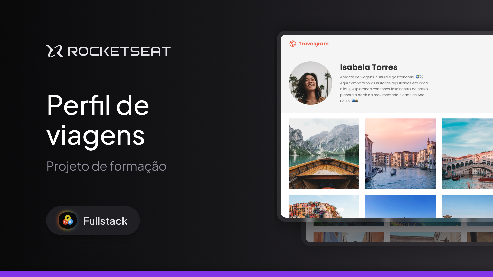

<p align="center">
  
</p>

# ✈️ Travelgram

Um projeto de perfil de viagens desenvolvido durante o curso **Especialista em Full Stack** da Rocketseat.
A aplicação simula uma rede social focada em compartilhar experiências, destinos e registros fotográficos ao redor do mundo.

---

## 📸 Preview

Interface moderna e responsiva com foco em:

- Perfil de usuário
- Galeria de fotos
- Navegação simples e elegante

---

## 🚀 Tecnologias utilizadas

- HTML5
- CSS3
- Google Fonts (Poppins)
- Figma

---

## 🎯 Funcionalidades

- Layout de perfil de viajante
- Exibição de informações pessoais (localização, países visitados, fotos)
- Galeria de imagens organizada em grid
- Navegação com menu superior
- Estrutura modular de CSS

---

## 📂 Estrutura do projeto

```
📁 project
 ┣ 📁 assets
 ┃ ┣ 📁 icons
 ┃ ┣ 📁 images
 ┃ ┗ 📄 Logo.svg
 ┣ 📁 styles
 ┃ ┣ 📄 global.css
 ┃ ┣ 📄 nav.css
 ┃ ┣ 📄 header.css
 ┃ ┣ 📄 main.css
 ┃ ┗ 📄 footer.css
 ┣ 📄 index.html
 ┗ 📄 README.md
```

---

## 💻 Como visualizar o projeto

1. Acesse: https://Matheus-Souza97.github.io/Travelgram

---

## 🎨 Conceitos aplicados

- Organização de CSS em múltiplos arquivos
- Uso de variáveis CSS (`:root`)
- Flexbox para layout
- Responsividade básica
- Boas práticas de semântica HTML

---

## 📄 Licença

Este projeto foi desenvolvido para fins educacionais durante o curso da Rocketseat.

---

## 👨‍💻 Autor

Desenvolvido por Matheus Souza durante os estudos
🚀 www.rocketseat.com.br
